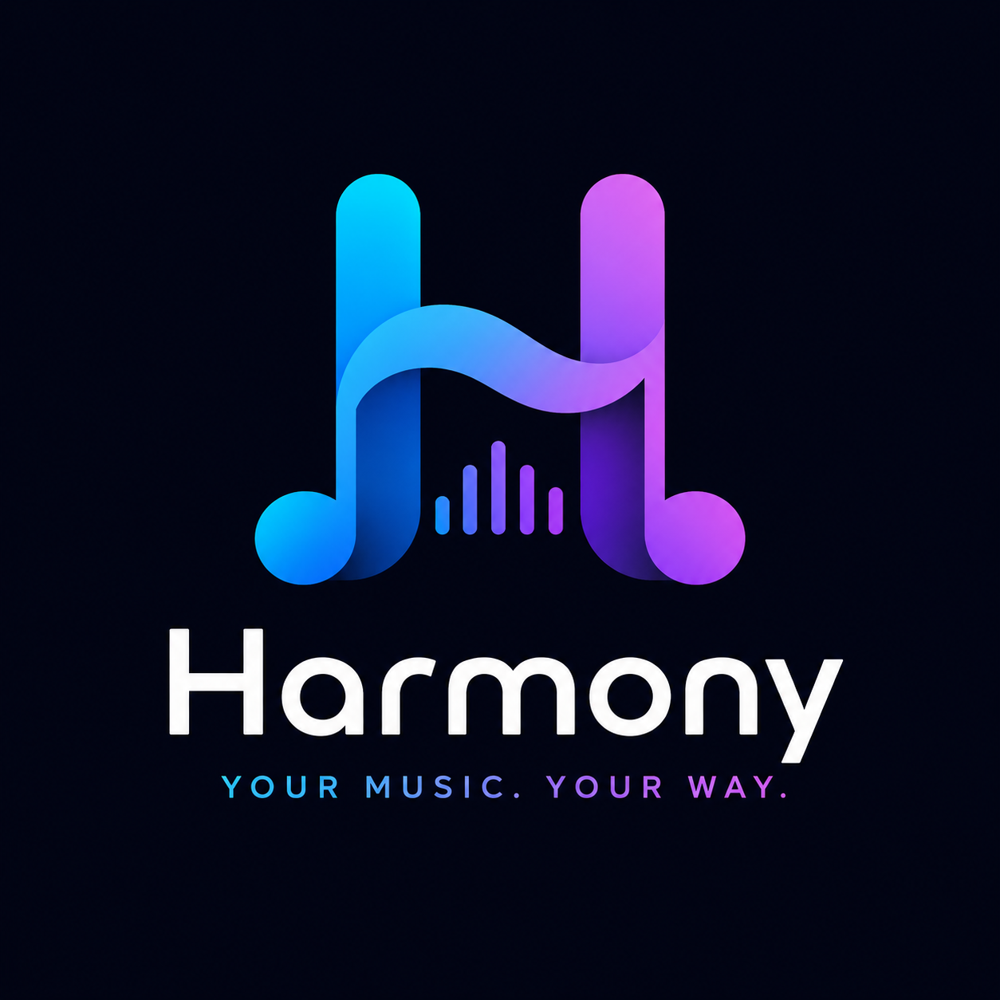

# Harmony

<p align="center">
  
</p>

<p align="center">
  <strong>Your Music. Your Way.</strong><br>
  A self-hosted music management platform that downloads, synchronizes, organizes, and manages your Spotify library for Navidrome and other media servers.
</p>

<p align="center">
  
  
  
  
  
</p>

---

## Overview

Harmony is a modern self-hosted music management platform that bridges Spotify with your local music library.

It automatically downloads tracks, synchronizes playlists, organizes your collection, exports M3U playlists, and provides a beautiful web interface for browsing your music. Harmony acts as the **single source of truth** for your library while integrating seamlessly with media servers such as **Navidrome**, **Jellyfin**, and **Plex**.

Current stable version: **v1.5.0**

See [CHANGELOG.md](CHANGELOG.md) for the complete development history and the
[v1.5.0 release notes](docs/releases/v1.5.0.md) for upgrade guidance.

---

# Features

## 🎵 Spotify Downloads

- Download tracks, albums, and playlists
- Multi-worker concurrent downloads
- Automatic retry support
- Live download progress
- Configurable audio quality (128 / 256 / 320 kbps)
- SpotDL integration
- Background download queue
- Automatic library import

---

## 🎼 Playlist Management

Harmony maintains Spotify playlists inside its own database.

Features include:

- Save Spotify playlists as Sources
- One-click synchronization
- Snapshot tracking
- Preserve playlist order
- Automatic duplicate detection
- Download only missing songs
- Automatic M3U generation
- Direct `.m3u` downloads from the web interface

---

## 📚 Library Foundation

Harmony's persistent Library Index is the single source of truth for managed
music. It stores stable Song IDs, paths, metadata, technical audio properties,
external identifiers, source provenance, artwork state, availability, and
timestamps.

The index updates incrementally through a supervised filesystem watcher. New,
modified, deleted, moved, and renamed files are reconciled without periodic
full-library scans. Library search, collections, analytics, health, and bulk
operations read this index instead of walking the music filesystem.

### Songs View

- Album artwork
- Artist
- Album
- Track selection
- Search
- Sorting
- Combined filters
- Multi-song selection
- Recently Added badges
- Responsive pagination

### Albums View

- Album artwork grid
- Track count
- Album duration
- Click to view album tracks

### Artists View

- Artist cards
- Song counts
- Album counts
- Click to browse artist collection

### Smart Collections and Health

- Recently Added and Recently Downloaded
- Highest Bitrate
- Missing Artwork and Missing Metadata
- Recently Modified
- Large Albums
- Favorites placeholder for a future favorites signal
- Library health score, indexing checks, and maintenance actions

---

## 🔍 Powerful Library Search

Search instantly across:

- Song titles
- Artists
- Albums
- Genres
- Filenames
- Playlist names
- Spotify track IDs
- MusicBrainz recording IDs
- ISRCs

Search is powered by SQLite FTS5 and reads only the Library Index—never audio
files or folders during a query.

---

## ↕ Advanced Sorting

Sort your library by:

- Artist
- Song Name
- Album
- Newest Added
- Duration
- Year
- Recently Modified
- Bitrate

Filters can be combined for artist, album, genre, codec, bitrate, downloaded
today, recently added, missing artwork, and missing metadata. Preferences are
stored in the browser.

---

## 🖼 Local Artwork Cache

- Detects embedded artwork and common folder artwork files
- Deduplicates identical images by SHA-256 checksum
- Stores reusable content-addressed cache files
- Serves immutable artwork through Library APIs
- Repairs missing cache files when a local source is available again

MusicBrainz Cover Art Archive downloads, Spotify artwork ingestion, and manual
replacement are intentionally reserved for future provider integrations.

---

## 📊 Analytics and Library Health

The Library dashboard reports songs, albums, artists, genres, storage usage,
average bitrate and duration, recently added music, and album insights.

The dedicated **Library Health** page adds:

- Missing artwork and missing metadata checks
- Weighted health score
- Library last-updated time
- Refresh Library and Rebuild Index
- Indexed-file verification
- Artwork-cache clearing
- Durable progress and cancellation

Duplicate Detection is currently displayed as a placeholder; Harmony does not
yet claim to calculate duplicate groups.

---

## 🧰 Bulk Library Operations

Select multiple Songs and run asynchronous:

- Delete
- Move
- Pattern-based rename
- Refresh metadata
- Refresh artwork cache
- ZIP export

Operations continue after individual failures and expose per-song progress,
errors, cancellation, and recovery through Harmony's task system.

---

## 📂 Automatic M3U Export

Harmony automatically exports playlists in standard `.m3u` format.

Compatible with:

- Navidrome
- Jellyfin
- Plex
- Kodi
- VLC
- Any M3U-compatible player

Features:

- Relative paths
- Unicode filenames
- Automatic regeneration
- Dedicated Playlists folder

---

## 🌍 Unicode Support

Harmony fully supports international filenames.

Playlists and music containing Bengali, Japanese, Arabic, Chinese, Korean, Cyrillic, Greek, Hindi, and many other languages are preserved correctly throughout the application.

---

## ⚙ Settings

Current configurable settings include:

- Download audio quality
- Storage paths
- Download engine
- Spotify configuration
- System information

Additional runtime settings are planned for future releases.

---

## 📱 Mobile Friendly

Harmony is designed for desktop and mobile devices.

Features include:

- Responsive layouts
- Touch-friendly controls
- Optimized album grids
- Responsive artist cards
- Mobile typography improvements
- Smooth scrolling
- Pagination optimized for smaller screens

---

# Download Pipeline

```text
Spotify
    │
    ▼
Fetch Metadata
    │
    ▼
Update Playlist Database
    │
    ▼
Generate M3U Playlists
    │
    ▼
Queue Missing Songs
    │
    ▼
Multi-worker Downloads
    │
    ▼
Staging Folder
    │
    ▼
Library Import
    │
    ▼
Persistent Library Index
    │
    ├── FTS Search
    ├── Artwork Cache
    ├── Collections / Analytics / Health
    │
    ▼
Rebuild Playlists
    │
    ▼
Navidrome / Jellyfin / Plex
```

---

# Technology Stack

### Backend

- Python 3.12
- FastAPI
- SQLAlchemy 2.0
- Alembic
- SpotDL
- Mutagen
- Watchdog

### Frontend

- HTML5
- CSS3
- Vanilla JavaScript
- Server-Sent Events (SSE)

### Database

- SQLite with WAL mode
- SQLite FTS5 Library search

### Deployment

- Docker
- Docker Compose
- Synology NAS
- Linux
- macOS
- Windows

---

# Installation

Clone the repository.

```bash
git clone https://github.com/azimul-kabir/harmony.git
cd harmony
```

Create your local environment.

```bash
cp .env.example .env.local
```

Configure Spotify credentials.

```env
SPOTIFY_CLIENT_ID=your_client_id
SPOTIFY_CLIENT_SECRET=your_client_secret
```

Review the storage paths before starting, especially when using Docker or a
Synology NAS:

```env
DATABASE_URL=sqlite:////database/harmony.db
MUSIC_PATH=/music
DOWNLOAD_PATH=/downloads
STAGING_PATH=/downloads/staging
FAILED_PATH=/downloads/failed
ARTWORK_CACHE_PATH=/database/artwork
```

The sample `docker-compose.yml` contains host volume examples. Replace those
host paths with directories that exist on your system before deployment.

Start Harmony.

```bash
docker compose up -d --build
```

Open:

```
http://localhost:8080
```

Interactive API documentation is available at:

```text
http://localhost:8080/docs
```

---

# Directory Structure

```text
Music/
├── Album Artist/
│   └── Album/
│       └── 01 - Track.flac
├── Another Artist/
│   └── Singles/
│       └── Track.mp3
├── Playlists/
│   ├── Chill Mix.m3u
│   ├── Road Trip.m3u
│   └── Workout.m3u

Database/
├── harmony.db
└── artwork/
```

The exact organization follows the configured import path rules. The database
and artwork cache should remain on persistent storage outside the music tree.

---

# Why Harmony?

Harmony is more than a Spotify downloader.

It continuously synchronizes Spotify playlists, downloads only missing tracks, organizes your music collection, exports playlists, and provides a modern interface for browsing your entire library.

```text
Spotify
    │
    ▼
 Harmony
    ├── Playlist Database
    ├── Music Library
    ├── Library Manager
    └── M3U Export
             │
             ▼
 Navidrome / Jellyfin / Plex
```

No duplicate downloads.

No broken playlists.

No manual playlist maintenance.

Just a synchronized self-hosted music library.

---

# Roadmap

## Near Term

### Operations and Automation

- Editable application settings
- Scheduled synchronization
- Backup & restore
- Import/export settings
- Direct Navidrome integration beyond the existing M3U workflow

---

### Library Intelligence

- Metadata editor
- Metadata repair workflows
- Duplicate detection and resolution
- Manual artwork replacement
- MusicBrainz metadata integration
- Cover Art Archive integration
- Advanced search improvements

---

### Smart Library

- Favorites
- Ratings
- Tags
- Smart Playlists
- User-defined collection rules

---

## Future

- Apple Music support
- YouTube Music support
- Deezer support
- Multiple music providers
- Multi-user support
- Plugin system
- API authentication and external integration hardening
- Navidrome synchronization hooks
- Progressive Web App (PWA)
- Lyrics support

---

# Screenshots

| Dashboard | Downloads |
|-----------|-----------|
| Coming Soon | Coming Soon |

| Sources | Playlists |
|----------|-----------|
| Coming Soon | Coming Soon |

| Library | Settings |
|----------|----------|
| Coming Soon | Coming Soon |

---

# Contributing

Contributions, bug reports, feature requests, and pull requests are always welcome.

If you have ideas to improve Harmony, feel free to open an issue or start a discussion.

Library changes should follow
[`docs/architecture/library.md`](docs/architecture/library.md), which is the
source of truth for Library ownership, service boundaries, API contracts, and
large-library performance requirements.

---

# License

Harmony is licensed under the MIT License.

See the **LICENSE** file for details.

---

<p align="center">
Made with ❤️ for self-hosted music enthusiasts.
</p>
