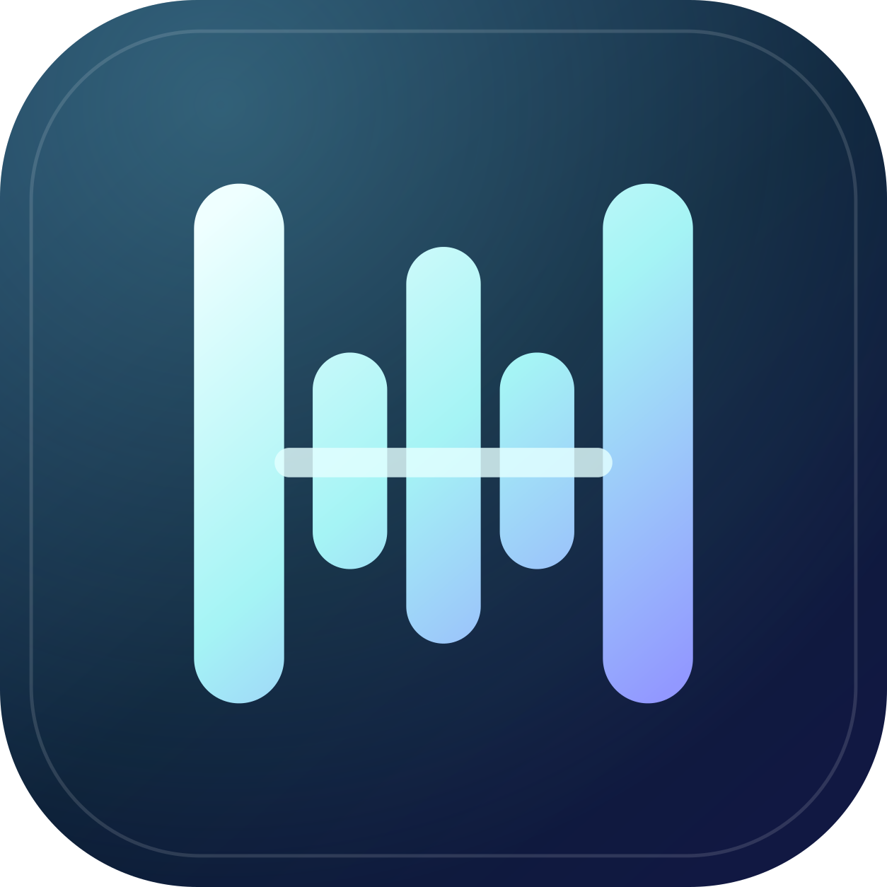

# Harmony

<p align="center">
  
</p>

<p align="center">
  <strong>Your Music. Your Way.</strong><br>
  A self-hosted music management platform that downloads, synchronizes, organizes, and manages your Spotify library for Navidrome and other media servers.
</p>

<p align="center">
  
  
  
  
  
</p>

---

## Overview

Harmony is a modern self-hosted music management platform that bridges Spotify with your local music library.

It automatically downloads tracks, synchronizes playlists, organizes your collection, exports M3U playlists, and provides a beautiful web interface for browsing your music. Harmony acts as the **single source of truth** for your library while integrating seamlessly with media servers such as **Navidrome**, **Jellyfin**, and **Plex**.

Current stable version: **v2.1.0**

See [CHANGELOG.md](CHANGELOG.md) for the complete development history and the
[v2.1.0 release notes](docs/releases/v2.1.0.md) for upgrade guidance and a
summary of the new login portal, playlist Sources, and Navidrome improvements.
Development toward the narrower v3 release is documented in the
[v3 preview notes](docs/releases/v3.0.0-preview.md) and the
[roadmap](docs/roadmap.md).
Harmony v1.6.0 was never published.

---

# Features

## 🎵 Spotify Downloads

- Download tracks, albums, and playlists
- Exact-match-only import: after Spotify metadata resolution, Harmony performs
  one bounded yt-dlp metadata search, validates candidates before transfer, and
  downloads only the strongest safe match. SpotDL remains the acquisition
  fallback when direct search or download cannot produce an acceptable result.
- Before import, Harmony requires exactly one audio file and validates its
  embedded primary artist, title, material version markers, and duration
  against the stored Spotify request. Instrumental, karaoke, live, remix,
  sped-up, slowed, acoustic, demo, radio-edit, remaster, cover, and tribute
  substitutions are rejected unless the requested title identifies the same
  version.
- A rejected or unavailable exact match stays failed and absent from the
  Library and playlist availability count, unless Harmony confirms that the
  requested recording is already available in the indexed Library. In that
  case the job is skipped and linked to the existing Library song.

## YouTube Music downloads and playlist sources

Harmony accepts public YouTube Music track (`music.youtube.com/watch?v=`) and
playlist (`music.youtube.com/playlist?list=`) URLs through yt-dlp. Standard
YouTube watch and playlist URLs are accepted as explicit user-provided fallback
inputs; Harmony does not claim every standard YouTube video is music. Discovery
currently uses bounded **general YouTube** `ytsearch` through yt-dlp, not a
dedicated YouTube Music catalogue search. Harmony uses yt-dlp for search and
audio extraction, so it does not add an authenticated scraper. Public requests
need no cookies by default, but operators can supply them when YouTube challenges
the server IP. Results and jobs retain only
normalized source metadata; extractor payloads and command output are not exposed.
YouTube availability is subject to region, age, removal, and rate-limit policies.
Enable it under **Settings → Downloads → Download Sources**. Use `YT_DLP_PATH`,
`YOUTUBE_MUSIC_ENABLED`, `YOUTUBE_MUSIC_TIMEOUT_SECONDS`, and the optional
`YT_DLP_COOKIE_FILE` to configure it. Cookie files must be mounted read-only;
Harmony uses a private writable runtime copy when yt-dlp needs a cookie jar, so
the mounted secret is never modified. See the configuration guide for details.

Public YouTube Music playlists can also be saved on the **Sources** page. Source
URLs are canonicalized to their `list` identity, so tracking parameters such as
`playnext` and `si` do not create duplicate Sources. Synchronization reads the
playlist without downloading, preserves its order, skips unavailable entries,
queues missing tracks through the YouTube Music download provider, exports the
same M3U representation used by Spotify Sources, and schedules the existing
Navidrome playlist reconciliation workflow. Source synchronization requires a
public `music.youtube.com/playlist?list=...` URL; watch, album, artist, and
channel URLs are not accepted as Sources.
- Multi-worker concurrent downloads

### Download details

The Downloads page includes a read-only details drawer for every visible job. It
shows available track metadata, status/stage, request/start/finish times,
timestamp-derived queue and processing durations, and the retry count. On
desktop it slides in from the right; on mobile it becomes a full-width panel
with a sticky header. Cancel remains available only for queued or running jobs;
no additional destructive or filesystem actions are provided.

The event timeline is deliberately limited to persisted lifecycle facts: queued
(created), started, and a completed, failed, cancelled, or skipped terminal
timestamp when present. Harmony does not persist intermediate downloader,
metadata, artwork, finalization, pause/resume, or retry transitions, so the
drawer does not invent them. The details API never exposes output or temporary
paths, provider URLs/payloads, credentials, command lines, or raw errors.
- Automatic retry support
- Live download progress
- Configurable audio quality (128 / 256 / 320 kbps)
- SpotDL integration
- Background download queue
- Automatic library import
- Existing embedded or indexed genres are preserved during download and import.
  Harmony no longer contacts Spotify solely to enrich genre tags.

---

## 🎼 Playlist Management

Harmony maintains Spotify and public YouTube Music playlists inside its own
database.

Features include:

- Save Spotify and public YouTube Music playlists as Sources
- One-click synchronization
- Snapshot tracking
- Preserve playlist order
- Automatic duplicate detection
- Download only missing songs
- Automatic M3U generation
- Direct `.m3u` downloads from the web interface
- Direct, order-preserving Navidrome playlist synchronization with safe M3U
  fallback
- Playlist availability counts, filtering, and one-click source resync
- Ordered playlist Library-file management and safe saved-playlist deletion
- Per-source scheduled auto-sync (hourly, every 6 or 12 hours, daily, or weekly)

---

## 📚 Library Foundation

Harmony's persistent Library Index is the single source of truth for managed
music. It stores stable Song IDs, paths, metadata, technical audio properties,
external identifiers, source provenance, artwork state, availability, and
timestamps.

The index updates incrementally through a supervised filesystem watcher. New,
modified, deleted, moved, and renamed files are reconciled without periodic
full-library scans. Library search, health, and bulk
operations read this index instead of walking the music filesystem.

### Songs View

- Album artwork
- Artist
- Album
- Track selection
- Search
- Sorting
- Combined filters
- Multi-song selection
- Recently Added badges
- Responsive pagination

### Albums View

- Album artwork grid
- Track count
- Album duration
- Click to view album tracks

### Artists View

- Artist cards
- Song counts
- Album counts
- Click to browse artist collection

### Library Filters and Health

- Recently Added
- Missing Artwork and Missing Metadata
- Direct library completeness and indexing checks with maintenance actions

---

## 🔍 Powerful Library Search

Search instantly across:

- Song titles
- Artists
- Albums
- Genres
- Filenames
- Playlist names
- Spotify track IDs
- MusicBrainz recording IDs
- ISRCs

Search is powered by SQLite FTS5 and reads only the Library Index—never audio
files or folders during a query.

---

## ↕ Advanced Sorting

Sort your library by:

- Artist
- Song Name
- Album
- Newest Added
- Duration
- Year
- Recently Modified
- Bitrate

Filters can be combined for artist, album, genre, codec, bitrate, downloaded
today, recently added, missing artwork, and missing metadata. Preferences are
stored in the browser.

---

## 🖼 Local Artwork Cache

- Detects embedded artwork and common folder artwork files
- Deduplicates identical images by SHA-256 checksum
- Stores reusable content-addressed cache files
- Serves immutable artwork through Library APIs
- Repairs missing cache files when a local source is available again
- Fetches and caches front artwork from the MusicBrainz Cover Art Archive for
  selected songs that have an accepted MusicBrainz release ID

To fetch online artwork, select songs in **Library → Songs** and choose
**Fetch album art**. Harmony uses the canonical `musicbrainz_release_id`
(MusicBrainz **Album Id**) for Cover Art Archive's `/release/{id}/front`
lookup. A `musicbrainz_release_group_id` is a different identifier and is
never sent to that endpoint. Songs without a release ID are skipped with a
clear explanation. A valid cached artwork result satisfies a normal fetch
without another network request.

**Refresh artwork** only re-indexes embedded/folder artwork and repairs
Harmony's cache association. The Harmony cache itself is not a Navidrome media
file; Navidrome continues to read artwork from the music library.

---

## 📊 Analytics and Library Health

The Library dashboard reports songs, albums, artists, genres, storage usage,
average bitrate and duration, recently added music, and album insights.

The dedicated **Library Health** page adds:

- Missing artwork and missing metadata checks
- Direct completeness and availability counts
- Library last-updated time
- Refresh Library and Rebuild Index
- Indexed-file verification
- Artwork-cache clearing
- Durable progress and cancellation

Duplicate detection groups conservative exact, strong, probable, and possible
matches. Resolution requires a fresh preview and explicit confirmation before
non-keeper files are queued for deletion.

---

## 🧰 Bulk Library Operations

Select multiple Songs and run asynchronous:

- Delete
- Move
- Pattern-based rename
- Refresh metadata
- Refresh artwork cache
- Fetch album art from Cover Art Archive
- ZIP export

Operations continue after individual failures and expose per-song progress,
errors, cancellation, and recovery through Harmony's task system.

---

## 🏷 Embedded Metadata

Harmony indexes the genre tag already present in an audio file; it deliberately
does not guess or silently overwrite genres while scanning. A **Refresh
metadata** or **Rebuild Index** therefore fills `genre` only when the file
itself contains a genre tag (for example ID3 `TCON`, Vorbis `GENRE`, or MP4
`©gen`).

---

## 📂 Automatic M3U Export

Harmony automatically exports playlists in standard `.m3u` format.

Compatible with:

- Navidrome
- Jellyfin
- Plex
- Kodi
- VLC
- Any M3U-compatible player

Features:

- Relative paths
- Unicode filenames
- Automatic regeneration
- Dedicated Playlists folder

---

## 🌍 Unicode Support

Harmony fully supports international filenames.

Playlists and music containing Bengali, Japanese, Arabic, Chinese, Korean, Cyrillic, Greek, Hindi, and many other languages are preserved correctly throughout the application.

---

## ⚙ Settings

Current configurable settings include:

- Download audio quality
- Storage paths
- Download engine
- Spotify configuration
- Optional YouTube Music download source
- Navidrome connection and playlist synchronization
- Cover Art Archive request settings
- Appearance, date/time, and runtime behavior
- System information

Cover Art Archive access can be tuned with the documented
`COVER_ART_ARCHIVE_*` environment variables in `.env.example`.

---

## 📱 Mobile Friendly

Harmony is designed for desktop and mobile devices.

Features include:

- Responsive layouts
- Installable Progressive Web App on supported browsers
- Offline connection screen when the Harmony server cannot be reached
- Compact mobile navigation and discoverable Settings sections
- Touch-friendly controls and safe-area spacing
- Optimized album grids
- Responsive artist cards
- Full-width mobile dialogs, drawers, and scrollable content regions
- Mobile typography, focus, overflow, and reduced-motion improvements
- Pagination optimized for smaller screens

---

# Download Pipeline

```text
Spotify
    │
    ▼
Fetch Metadata
    │
    ▼
Update Playlist Database
    │
    ▼
Generate M3U Playlists
    │
    ▼
Queue Missing Songs
    │
    ▼
Multi-worker Exact Spotify-URL Download
    │
    ▼
Isolated Temporary Output
    │
    ▼
Identity Validation
    │
    ▼
Staging Folder
    │
    ▼
Library Import
    │
    ▼
Persistent Library Index
    │
    ├── FTS Search
    ├── Artwork Cache
    ├── Collections / Analytics / Health
    │
    ▼
Rebuild Playlists
    │
    ▼
Navidrome / Jellyfin / Plex
```

---

# Technology Stack

### Backend

- Python 3.12
- FastAPI
- SQLAlchemy 2.0
- Alembic
- SpotDL
- Mutagen
- Watchdog

### Frontend

- HTML5
- CSS3
- Vanilla JavaScript
- Server-Sent Events (SSE)

### Database

- SQLite with WAL mode
- SQLite FTS5 Library search

### Deployment

- Docker
- Docker Compose
- Synology NAS
- Linux
- macOS
- Windows

---

# Installation

`pyproject.toml` is Harmony's canonical dependency manifest. The filesystem
watcher is a required production dependency because the Library watcher is
enabled by default; installing Harmony always installs `watchdog`.

Clone the repository.

```bash
git clone https://github.com/azimul-kabir/harmony.git
cd harmony
```

Create your local environment.

```bash
cp .env.example .env
```

Before starting, set a long, unique `WEB_AUTH_PASSWORD` in `.env`.
`WEB_AUTH_USERNAME` defaults to `admin`; authentication is enabled by default
and fails closed when the password is empty. Login sessions last 12 hours by
default and are invalidated whenever the password changes.

Spotify credentials remain optional and are needed only when the official
Spotify metadata API is explicitly enabled. Harmony does not contact Spotify
solely to enrich genres.

Review the storage paths before starting, especially when using Docker or a
Synology NAS:

```env
DATABASE_URL=sqlite:////database/harmony.db
MUSIC_PATH=/music
DOWNLOAD_PATH=/downloads
STAGING_PATH=/downloads/staging
FAILED_PATH=/downloads/failed
ARTWORK_CACHE_PATH=/database/artwork
```

The Compose file reads this same `.env` file. Set `MUSIC_HOST_PATH` and
`DOWNLOAD_HOST_PATH` when you want to use NAS shared folders. Without those
overrides, Harmony stores music and downloads in local project folders;
database and log data remain in `./database` and `./logs`. Set
`WEB_AUTH_SECURE_COOKIE=true` when an HTTPS reverse proxy is in front of
Harmony.

Start Harmony.

```bash
docker compose up -d --build
```

### Pull the preview image on Synology

The completed Harmony v3 branch publishes an Intel/AMD image for Synology
models such as the DS220+ to GitHub Container Registry. Pull it from Container
Manager or over SSH:

```bash
docker pull ghcr.io/azimul-kabir/harmony:v3-preview
```

Use `ghcr.io/azimul-kabir/harmony:v3-preview` as the image name in a Synology
Container Manager project. If the package is private, sign in to `ghcr.io`
with the GitHub username and a personal access token that has `read:packages`.

Opening a pull request runs CI, including a production-image build that is
discarded after validation. It does **not** publish a registry image. The
`v3-preview` image is built and pushed only from the
`codex/harmony-v3-completed` branch; `main` publishes `latest`, version tags
publish their matching tag, and maintainers can also start the publish workflow
manually. All published images currently target `linux/amd64` for Synology
models such as the DS220+.

Open:

```
http://localhost:8080/login
```

Interactive API documentation is available at:

```text
http://localhost:8080/docs
```

## Development and Testing

Install the development extra before running tests. It includes pytest as well
as Harmony's required runtime dependencies, including `watchdog` and its
watcher tests:

```bash
python -m pip install --upgrade pip
python -m pip install -e ".[dev]"
python -m pytest
```

Do not install from a separate requirements file: production, development, and
test dependencies are declared in `pyproject.toml`. If dependency installation
fails, resolve the package index, proxy, or network configuration first rather
than skipping the watcher tests.

---

# Directory Structure

```text
Music/
├── Album Artist/
│   └── Album/
│       └── 01 - Track.flac
├── Another Artist/
│   └── Singles/
│       └── Track.mp3
├── Playlists/
│   ├── Chill Mix.m3u
│   ├── Road Trip.m3u
│   └── Workout.m3u

Database/
├── harmony.db
└── artwork/
```

The exact organization follows the configured import path rules. The database
and artwork cache should remain on persistent storage outside the music tree.

---

# Why Harmony?

Harmony is more than a Spotify downloader.

It continuously synchronizes Spotify playlists, downloads only missing tracks, organizes your music collection, exports playlists, and provides a modern interface for browsing your entire library.

```text
Spotify
    │
    ▼
 Harmony
    ├── Playlist Database
    ├── Music Library
    ├── Library Manager
    └── M3U Export
             │
             ▼
 Navidrome / Jellyfin / Plex
```

No duplicate downloads.

No broken playlists.

No manual playlist maintenance.

Just a synchronized self-hosted music library.

---

# Roadmap

## Near Term

### Operations and Automation

- Backup & restore
- Import/export settings
- Additional media-server API integrations beyond Navidrome
- Schedule history and missed-run visibility

---

### Library Intelligence

- Optional metadata editing and repair workflows
- Advanced search improvements

---

### Smart Library

- Favorites
- Ratings
- Tags
- User-defined collection rules

---

## Future

- Apple Music support
- Deezer support
- Multiple music providers
- Multi-user support
- Plugin system
- API authentication and external integration hardening
- Additional Navidrome event hooks

---

# Screenshots

| Dashboard | Downloads |
|-----------|-----------|
| Coming Soon | Coming Soon |

| Sources | Playlists |
|----------|-----------|
| Coming Soon | Coming Soon |

| Library | Settings |
|----------|----------|
| Coming Soon | Coming Soon |

---

# Contributing

Contributions, bug reports, feature requests, and pull requests are always welcome.

If you have ideas to improve Harmony, feel free to open an issue or start a discussion.

Library changes should follow
[`docs/architecture/library.md`](docs/architecture/library.md), which is the
source of truth for Library ownership, service boundaries, API contracts, and
large-library performance requirements.

# License

Harmony is licensed under the MIT License.

See the **LICENSE** file for details.

---

<p align="center">
Made with ❤️ for self-hosted music enthusiasts.
</p>
